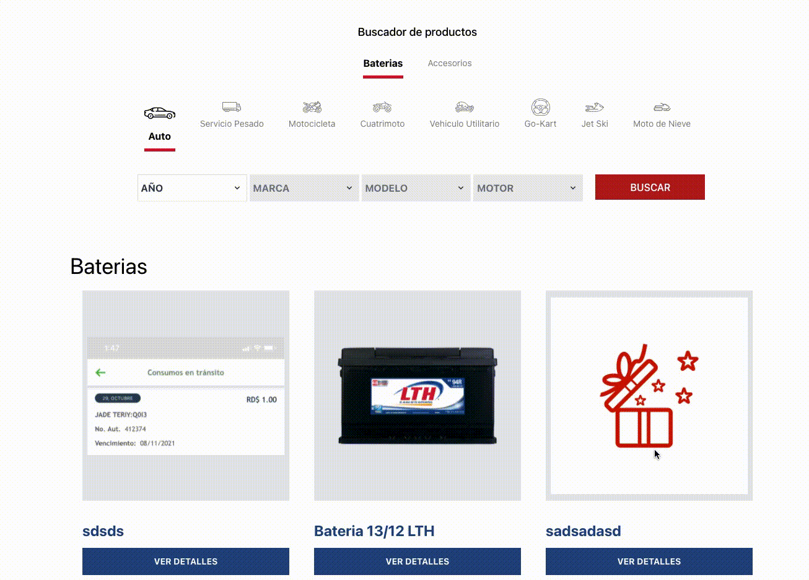

# Product Firebase Crud

This project was inspired by the [www.lth.mx](www.lth.mx) platform, and it purpose is to demostrate how easly is to work with the following techs:

- [nodeJs 15.4.0](https://nodejs.org/es/)
- [ReactJs 17.0.2](https://reactjs.org/)
- [Tailwind 2.2.17](https://tailwindcss.com/)
- [Firebase 9.1.3](https://firebase.google.com/)

## Setup

1. Clone repository `git clone https://github.com/delciopolanco/product-firebase-crud.git`
2. Install dependencies `npm install`
3. Create _.env_ file
5. Configure firebase account and use fireStoreDatabase + Storage.
4. Configure this structure in your firebase collections:

### Brands

```json
[
  {
    "models": [
      { "motors": ["2.8 LT", "2.4 LT"], "name": "civic" },
      { "motors": ["1.8 LT", "1.4 LT"], "name": "city" }
    ],
    "name": "Honda",
    "years": [1990, 1991, 2022]
  }
]
```

### Categories

```json
{
  "catetories": ["Baterias", "Aditivos", "Filtros de aceites"]
}
```

### Products

```json
[
  {
    "category": "Aditivos",
    "code": "ASDD-98777",
    "description": "My product",
    "name": "OIL 234",
    "reference": "OIL-111222334",
    "spects": [{"name": "Volumen", "value": "15 Degrees"}]
    "pictures": ["https://firebasestorage.googleapis.com/v0/b/products-searcher.appspot.com/o/images%2FIMG_812A23D9281F-1.jpeg?alt=media&token=3279209d-e3d9-4b17-b111-26049d3c810d"],

  }
]
```

### years

```json
{
  "years": [1990, 1991, 2002]
}
```

### Project Alive! 

Ready to use it! 

#### Filters

[](https://)


#### TODO

1. Adding a clear documentation.
2. Adding storybook in each component.
3. Remove console logs. 
4. Adding functional programming styles.
5. Use internationalization.
6. Adding responsive css.
7. more.... :)